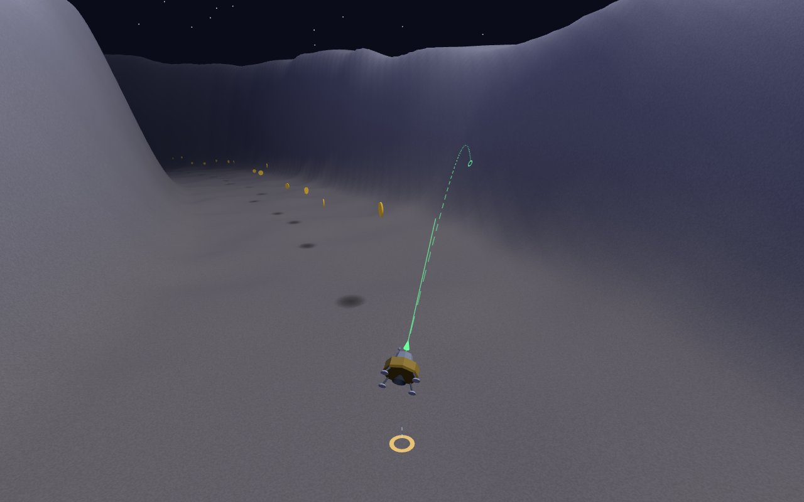

# 💥 Dynamite Chair 3D

**[▶ Play it now](https://vector76.github.io/dynamite_chair_3d/)** — no install, runs in the browser.

The [Dynamite Chair](https://github.com/vector76/dynamite_chair) mechanic —
no throttle, only **fixed-impulse dynamite blasts** fired along the direction
your craft points — taken into 3D. Race a ballistic arc down a canyon carved
into procedural terrain, blasting to arrest your descent and steer, sweeping
up coins against the clock.



Between blasts you are in pure free-fall: gravity is always winning, and each
kick is one identical impulse followed by a ~3 s cooldown — so every blast is
a commitment, not a throttle. Any contact with the ground ends the run.

## How to play

Each run produces a **(coins, time)** score. There is deliberately no single
number: the game keeps your per-level **personal-best frontier** — every run
not beaten on both axes — and plots it at the end of each level. Chase the
speedrun line, the completionist line, or anything between.

- Levels are fixed-seed: the same level is the same canyon every run, so
  times are comparable. Finishing a level unlocks the next; the ◀ ▶ arrows
  on any pause/end screen replay earlier levels.
- Flying up out of the canyon is allowed — it just costs time.

## Controls

| Input | Action |
| --- | --- |
| Mouse | Aim the craft (pointer lock) |
| Click / Space | Fire a charge |
| Wheel | Zoom the chase camera |
| V | Toggle trajectory prediction (off = hard mode) |
| I | Invert mouse Y |
| M | Mute |
| R | Restart level |
| Esc | Pause (blackout — no free strategizing) |

The trajectory assist shows two arcs: the **committed arc** (where you go if
you don't blast again) and the **blast-now arc** (where you'd go if you fired
this instant), each with a terrain-impact marker.

## Running locally

Any static server in the repo root, e.g.:

```
python -m http.server
```

then open `http://localhost:8000`. No build step, no dependencies to install.

## Constraints

- 100% static — hosted on GitHub Pages, no backend.
- No build step — Three.js is vendored as an ES module.
- No runtime binary assets — procedural terrain, synthesized WebAudio SFX,
  primitive-built craft.

## Docs

- [Game design](docs/GAME_DESIGN.md) — concept, mechanics, controls, design decisions
- [Architecture](docs/ARCHITECTURE.md) — stack, file layout, core systems, deployment
- [Roadmap](docs/ROADMAP.md) — milestones
